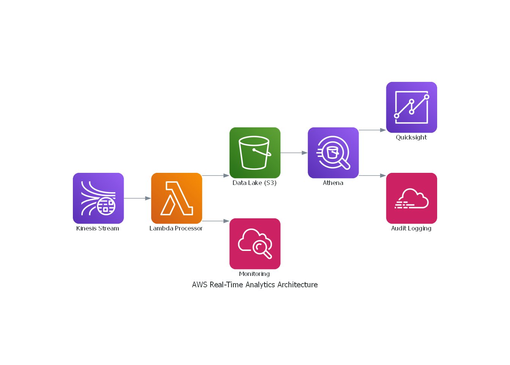

## Cost-Efficient AWS Project: Real-Time Data Analytics Pipeline

### Objective

Create an affordable, scalable, and secure event-driven AWS architecture for ingesting, processing, analyzing, and visualizing real-time data with minimal operational costs.

---

### Architecture Overview (Cost-Optimized)



- **Data Ingestion:** Amazon Kinesis Data Streams (1 shard)
- **Real-time Processing:** AWS Lambda (short runtime, low memory)
- **Data Storage:** Amazon S3 (Intelligent-Tiering)
- **Analytics:** Amazon Athena
- **Visualization:** Amazon QuickSight (pay-per-session)
- **Monitoring & Security:** AWS CloudWatch (basic), AWS IAM, AWS CloudTrail

---

### Implementation Details

[Full Terraform, Lambda, SQL, and Python code included in this repo.]

---

### Deployment Instructions

1. Install AWS CLI and Terraform.
2. Zip your Lambda function:
   ```
   zip lambda_function_payload.zip lambda/lambda_function.py
   ```
3. Deploy with Terraform:
   ```
   terraform init
   terraform apply
   ```
4. Use `sample-data/send_sample_events.py` to send sample events to Kinesis.
5. Verify in CloudWatch, S3, Athena, and QuickSight.

---

### Sample Data Generator (Python)

Sends events to your Kinesis stream.

---

### Optional Optimizations

- S3 triggers
- Athena partitions
- Step Functions
- AWS CDK

This project is serverless, scalable, and cost-efficient.
